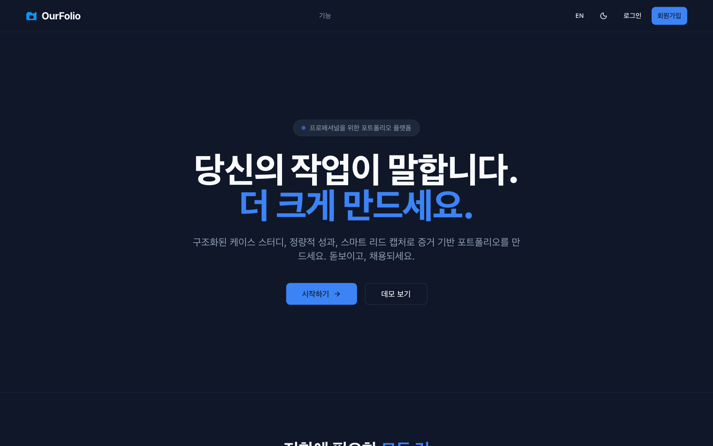
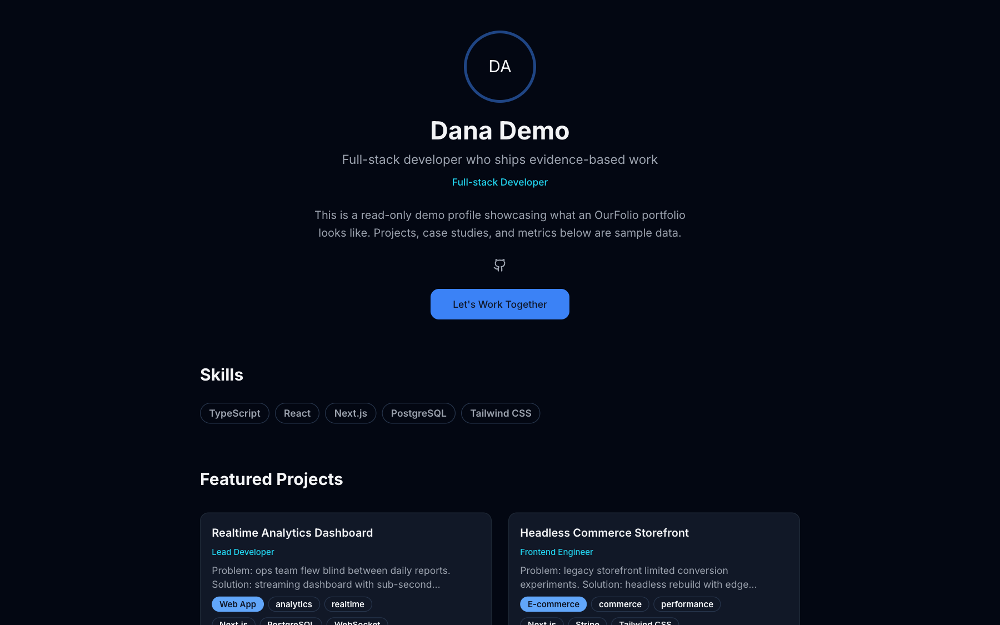

# Ourfolio

증거 기반 포트폴리오 빌더. 프로필과 프로젝트를 등록하면 `/{username}` 공개 페이지로 전시되고, 방문자 리드 수집과 조회 애널리틱스를 제공합니다.

- **라이브 데모**: <https://ourfolio.bkan.dev/demo> — 읽기 전용 `demo` 프로필(시드 데이터, 실계정 아님)
- **소스 코드**: <https://github.com/Bkankim/project-ourfolio> — 공개 미러(원본에서 자동 동기화)

> 이 리포는 수익화 SaaS가 아닌 포트폴리오 전시(showcase) 용도로 운영됩니다.

## 스크린샷

| 랜딩 | 공개 데모 프로필 |
| --- | --- |
|  |  |

## 아키텍처

| 레이어 | 기술 |
| --- | --- |
| 프레임워크 | Next.js 16 (App Router, React 19) |
| 데이터베이스 | Neon (serverless Postgres) + drizzle-orm / drizzle-kit |
| 인증 | BetterAuth — Google · GitHub OAuth |
| 파일 스토리지 | Cloudflare R2 (S3 호환 API, 공개 `*.r2.dev` URL) |
| 이메일 | Resend |
| 에러 트래킹 | Sentry (`@sentry/nextjs`) |
| 배포 | Vercel (region: icn1) |

## 기능

- **프로필 / 프로젝트**: 공개 포트폴리오 페이지(`/{username}`), 프로젝트 상세, OG 이미지 동적 생성
- **리드 수집**: 방문자 문의 폼 → `leads` 테이블 + Resend 이메일 알림
- **애널리틱스**: 페이지 뷰·이벤트 자체 수집(`analytics_events`) + 대시보드 통계
- **GitHub repo import**: GitHub OAuth 연동으로 저장소 메타데이터를 프로젝트로 가져오기
- **이미지 업로드/크롭**: react-easy-crop → R2 presigned 업로드
- **i18n**: ko / en 로케일 (키 대칭을 테스트로 강제 — `tests/i18n.test.ts`)
- **동의 관리(consents)**: 약관·개인정보 동의 이력 저장, `policyVersion` 버저닝

## 기술적 근거 (하이라이트)

- **Expand–contract 마이그레이션**: 스키마 v1 전환을 `drizzle/0002_v1_expand.sql` → `0003_v1_contract.sql` 2단계로 분리해 무중단 배포와 호환성을 확보
- **동의 버저닝**: `consents.policyVersion`으로 정책 개정 시 재동의 추적 가능
- **Sentry PII 스크러빙**: `src/lib/sentry-scrub.ts`에서 이메일·토큰 등 민감 정보를 이벤트 전송 전 제거 (`tests/sentry-scrub.test.ts`)

## 로컬 실행

```bash
cp .env.example .env.local   # 값 채우기 (Neon DATABASE_URL 등)
pnpm install
pnpm db:migrate
pnpm db:seed                 # 읽기 전용 demo 프로필 + 예시 프로젝트 시드
pnpm dev
```

<http://localhost:3000> 접속. 시드 후 <http://localhost:3000/demo> 에서 데모 포트폴리오를 확인할 수 있습니다.

시드 스크립트(`scripts/seed-demo.ts`)는 멱등(idempotent)하며, 프로덕션 호스트(DATABASE_URL이 neon.tech 등 non-localhost)에서는 `SEED_ALLOW_PROD` 없이 실행되지 않습니다.

## 검증

```bash
pnpm typecheck && pnpm lint && pnpm test && pnpm build
```

## 데모 계정 안내

`/demo`는 시드된 읽기 전용 프로필입니다. 로그인 가능한 실계정이 아니며, 대시보드 기능은 OAuth 로그인 후 본인 계정으로 확인할 수 있습니다.
